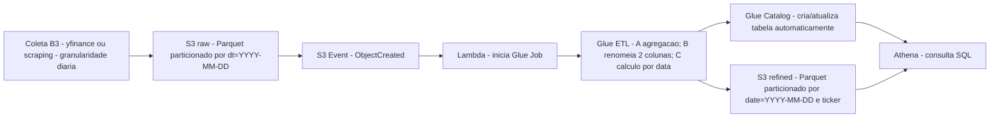

# Pipeline - Diagrama Mermaid

Abaixo está um diagrama Mermaid que representa o pipeline descrito no documento "Tech Challenge Fase 2 - Machine Learning Avançado".

Legenda (mapeamento para os requisitos):

- Requisito 1: Coleta de dados de ações/índices da B3 com granularidade diária (nó `Coleta B3`).
- Requisito 2: Dados brutos ingeridos no S3 em formato Parquet com partição diária (nó `S3 raw`).
- Requisito 3: Evento do S3 aciona uma Lambda (nó `S3 Event`).
- Requisito 4: Lambda (qualquer linguagem) apenas inicia o Job Glue (nó `Lambda`).
- Requisito 5: Job Glue com transformações obrigatórias A, B e C (nó `Glue ETL`).
- Requisito 6: Dados refinados em `refined`, Parquet particionado por data e ticker/código (nó `S3 refined`).
- Requisito 7: Glue Catalog automático com criação/atualização de tabela (nó `Glue Catalog`).
- Requisito 8: Dados disponíveis para consultas SQL no Athena (nó `Athena`).
